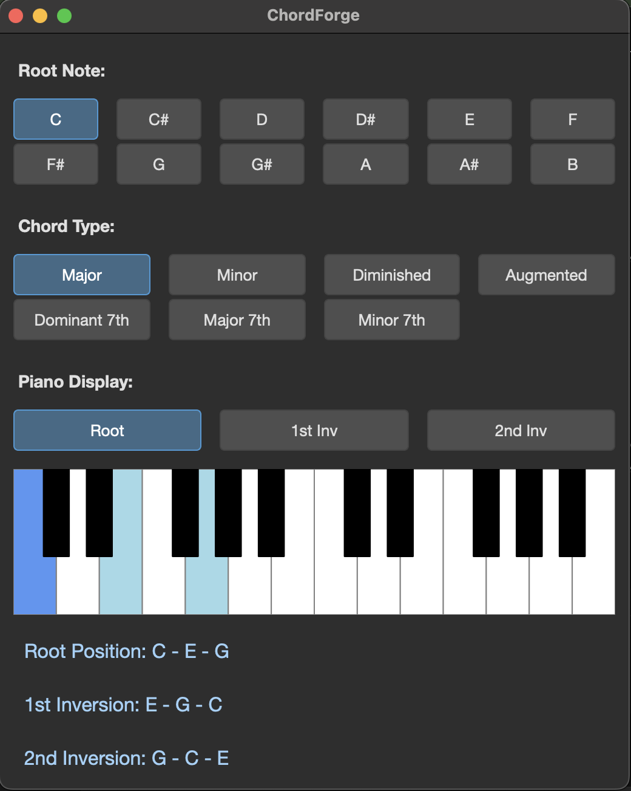

# ChordForge

ChordForge is a desktop application developed with C++ and Qt6, designed to help musicians and students learn and visualize musical chords. You can select a root note and a chord type, and the application will calculate the notes of the chord, highlighting them on a virtual piano keyboard. It also displays the notes for each inversion.




## Features

*   **Chord Calculation**: Supports various chord types, including Major, Minor, Diminished, Augmented, and various 7th chords.
*   **Visual Piano Keyboard**: Instantly highlights the keys for the selected chord on a clean piano interface.
*   **Chord Inversions**: Clearly lists and displays the root position, 1st inversion, 2nd inversion, and (where applicable) 3rd inversion on the piano.
*   **Interactive Interface**: Easily select the root note and chord type with button clicks for real-time updates.
*   **Dark Theme**: Features a comfortable and modern dark user interface.

## Prerequisites

Before building the project, ensure you have the following installed:

*   A C++17 compatible compiler (e.g., GCC, Clang, MSVC)
*   CMake (version 3.16 or higher)
*   Qt6 (Core and Widgets modules)

## Build Instructions

You can build and run the application by following these steps:

1.  **Clone the repository**
    ```bash
    git clone <your-repository-url>
    cd ChordForge
    ```

2.  **Create a build directory and run CMake**
    This step generates the necessary build files inside the `build` directory.
    ```bash
    mkdir build
    cd build
    cmake ..
    ```
    *If Qt6 is not installed in a standard path, you might need to specify the `CMAKE_PREFIX_PATH`:*
    `cmake .. -DCMAKE_PREFIX_PATH=/path/to/your/Qt6/lib/cmake`

3.  **Compile the project**
    From the project's **root directory** (you may need to `cd ..` to exit the build directory), run the following command. It invokes the native build tools to compile the code.
    ```bash
    cmake --build build
    ```

## Usage

After compilation, the executable `ChordForge` (or `ChordForge.exe` on Windows) will be located in the `build` directory. Simply run it to start the application.

## License

This project is licensed under the terms specified in the [LICENSE](LICENSE) file.